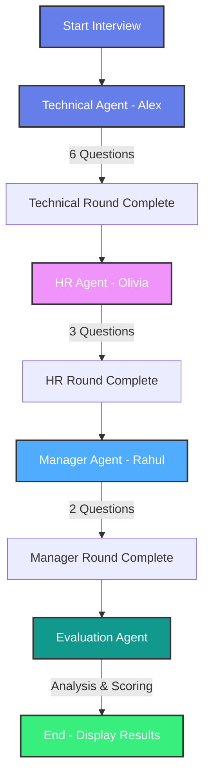

# 🤖 AI Interviewer - Multi-Agent Interview Simulation Platform

A realistic AI-powered interview simulation system built with **LangGraph** and **Azure OpenAI**. This project demonstrates multi-agent orchestration where three specialized AI agents (Technical, HR, and Manager) conduct a comprehensive interview, followed by an AI-powered evaluation.

## 🌟 Features

### Multi-Agent Interview System
- **💻 Technical Agent (Alex)**: Asks 6 technical questions focusing on coding, system design, and problem-solving
- **🤝 HR Agent (Olivia)**: Asks 3 questions about cultural fit, soft skills, and teamwork
- **👔 Manager Agent (Rahul)**: Asks 2 questions about leadership, strategy, and career vision
- **🎯 Evaluation Agent**: Provides comprehensive AI-generated feedback with scores, strengths, weaknesses, and suggestions

### Key Capabilities
- **Experience-Level Adaptive**: Questions tailored to Junior, Mid-Level, or Senior positions
- **Resume Upload Support**: Upload PDF, DOCX, or TXT resumes for personalized questions
- **LangGraph Orchestration**: Sophisticated workflow management with state transitions
- **Azure OpenAI Integration**: Leverages Azure OpenAI models for intelligent question generation
- **Context-Aware**: Agents adapt questions based on previous answers, candidate profile, and resume
- **Professional Web UI**: Beautiful Streamlit interface with real-time progress tracking
- **AI-Powered Evaluation**: Intelligent analysis of interview performance across all rounds
- **Comprehensive Logging**: Detailed logging system for debugging and monitoring
- **Modular Architecture**: Clean, maintainable code following industry best practices

## 📁 Project Structure

```
AI_Interviewer/
├── .streamlit/
│   └── config.toml              # Streamlit auto-reload configuration
├── config/
│   ├── __init__.py
│   ├── settings.py              # Environment variables and configuration
│   └── logging_config.py        # Logging setup with file and console handlers
├── logs/                        # Application logs (auto-generated, not in git)
│   └── ai_interviewer_*.log     # Timestamped log files
├── src/
│   ├── __init__.py
│   ├── agents/
│   │   ├── __init__.py
│   │   ├── base_agent.py        # Base agent class with LLM initialization
│   │   ├── technical_agent.py   # Alex - Technical interviewer (6 questions)
│   │   ├── hr_agent.py          # Olivia - HR interviewer (3 questions)
│   │   ├── manager_agent.py     # Rahul - Hiring manager (2 questions)
│   │   └── evaluation_agent.py  # AI evaluation specialist with scoring
│   ├── graph/
│   │   ├── __init__.py
│   │   ├── state.py             # State management with TypedDict and Pydantic models
│   │   └── workflow.py          # LangGraph workflow orchestration with routing logic
│   └── prompts/
│       ├── __init__.py
│       └── templates.py         # Agent prompts, personalities, and resume context
├── app.py                       # Streamlit web application (Main UI) ⭐
├── main.py                      # CLI application (Alternative interface)
├── azure_clients.py             # Azure OpenAI client initialization
├── test_agent.py                # Test script for individual agents
├── .env                         # Environment variables (not in git)
├── .gitignore                   # Git ignore patterns
├── requirements.txt             # Python dependencies
├── STREAMLIT_README.md          # Streamlit-specific documentation
└── README.md                    # This file
```


```

**Features:**
- 🎨 Professional gradient UI design
- � Resume upload with automatic text extraction (PDF, DOCX, TXT)
- �📊 Real-time progress tracking across all interview rounds
- 🤖 AI-powered evaluation with detailed feedback
- 🎯 Automatic scoring (0-100)
- 💪 Personalized strengths analysis
- 🔧 Constructive areas for improvement
- 💡 Actionable suggestions for growth
- 📋 Complete interview transcript
- 🔄 Automatic reload on code changes
- 📝 Resume preview before interview starts
- 🎯 Context-aware questions based on uploaded resume


### Interview Flow

1. **Welcome Screen** 👋
   - Enter your name
   - Select job role (Software Engineer, Data Scientist, Product Manager, etc.)
   - Choose experience level (Junior/Mid-Level/Senior)
   - **Upload Resume (Optional)** 📄
     - Supports PDF, DOCX, and TXT formats
     - Resume content is extracted and used for personalized questions
     - Preview extracted text before starting

2. **Technical Round** 💻 (6 questions)
   - Alex, the Technical Interviewer, asks coding, system design, and problem-solving questions
   - Questions adapt to your experience level and resume content
   - Topics: algorithms, best practices, system architecture, technical skills

3. **HR Round** 🤝 (3 questions)
   - Olivia, the HR Manager, assesses cultural fit and soft skills
   - Focus on teamwork, communication, conflict resolution, and values
   - Questions may reference your resume experience

4. **Managerial Round** 👔 (2 questions)
   - Rahul, the Hiring Manager, evaluates leadership and strategic thinking
   - Questions about decision-making, career vision, and growth potential
   - Tailored to your experience level and background

5. **AI Evaluation** 🎯
   - Comprehensive analysis of your entire interview performance
   - Detailed score (0-100) with clear breakdown
   - Specific strengths identified across all rounds
   - Constructive areas for improvement with context
   - Actionable suggestions for professional growth
   - Overall hiring recommendation based on performance

### Example Web Interface

Visit the app to experience:
- Beautiful gradient cards for each interview round
- Resume upload section with drag-and-drop support
- File format validation and automatic text extraction
- Resume content preview with character count
- Real-time question counters (e.g., "Question 3/6")
- Progress bar showing overall completion
- Professional results screen with color-coded scores
- Detailed feedback sections with icons and formatting
- Comprehensive logging for debugging and monitoring

## 🏗️ Architecture

### LangGraph Workflow

The system uses LangGraph to orchestrate a multi-agent interview process with AI evaluation:



**Workflow Details:**
- **Technical Agent (Alex)**: Asks 6 technical questions about coding, system design, and algorithms
- **HR Agent (Olivia)**: Asks 3 questions about cultural fit, soft skills, and teamwork
- **Manager Agent (Rahul)**: Asks 2 questions about leadership, strategy, and career vision
- **Evaluation Agent**: Analyzes entire interview and provides score, strengths, weaknesses, and suggestions
- **Results**: Comprehensive evaluation with actionable feedback

### State Management

### Agent Design

Each agent:
- Inherits from `BaseAgent`
- Has a unique personality defined in prompt templates
- Uses Azure OpenAI via centralized client (`azure_clients.py`)
- Maintains context from previous answers
- Adapts questions dynamically based on experience level
- Leverages resume content when available for personalized questions
- Generates natural, conversational questions without numbering
- Logs all question generation and state transitions

## 🛠️ Technical Components

### Logging System
- **File Handler**: Writes detailed DEBUG logs to `logs/ai_interviewer_TIMESTAMP.log`
- **Console Handler**: Displays INFO level logs to terminal
- **Module-Level Loggers**: Each module has its own logger for granular tracking
- **HTTP Noise Reduction**: Suppresses verbose logs from httpx, httpcore, openai libraries
- **Automatic Directory Creation**: `logs/` directory created automatically if needed

### Document Processing
- **PDF Support**: PyPDF2 for extracting text from PDF resumes
- **DOCX Support**: python-docx for parsing Word documents
- **TXT Support**: Native text file reading
- **Character Limit**: Resume text limited to first 2000 characters for context injection
- **Error Handling**: Graceful fallback if resume parsing fails


## 👤 Author

**Debdoot**
- GitHub: [@debdoot9804](https://github.com/debdoot9804)

## 🙏 Acknowledgments

- Built with [LangGraph](https://github.com/langchain-ai/langgraph) for multi-agent orchestration
- Powered by [Azure OpenAI](https://azure.microsoft.com/en-us/products/ai-services/openai-service)
- Uses [LangChain](https://github.com/langchain-ai/langchain) framework
- UI built with [Streamlit](https://streamlit.io/)
- Colorful terminal output with [Colorama](https://github.com/tartley/colorama)
